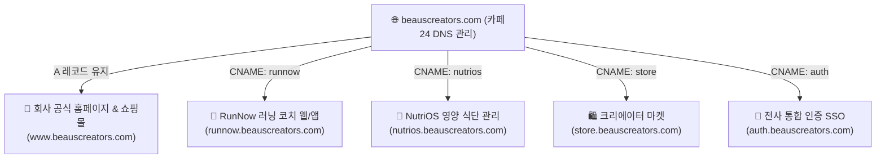
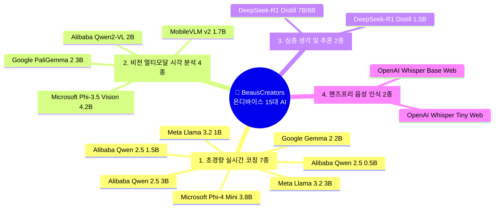

# 06. BeausCreators 온디바이스(On-Device) 15대 AI 모델 & 도메인 라우팅 마스터 가이드북

> **문서 코드**: SPEC-AI-20260902-06  
> **프로젝트**: RunNow & BeausCreators Family Platform  
> **최초 작성일**: 2026-09-02  
> **책임자**: CTO 거누 (Backend/Infra/Architecture Lead)  
> **승인자**: 이건우 대표님 (BSC CEO)  
> **상태**: 승인 완료 (전사 표준 아키텍처)

---

## 1. 비즈니스 개요 및 핵심 원칙 (Core Principles)

본 문서는 `beauscreators.com` 브랜드 기반의 멀티 서비스 확장과 **WebGPU 기반 온디바이스(On-Device) 15대 AI 모델 정예 패키지**의 설계·배포·운영 표준을 정의합니다.

### 🌟 4대 핵심 가치
1. **서버 비용 완전 $0 (Zero Infra Cost)**: 사용자 수가 1,000만 명으로 급증해도 대표님 계좌에서 지출되는 AI 서버 비용 0원.
2. **100% 완벽한 프라이버시 (Zero Data Leak)**: 위치, 심박수, 러닝화 사진, 식단 데이터가 외부 서버로 전송되지 않고 기기 내에서만 처리.
3. **0.1~0.3초 초광속 반응 (Ultra-Low Latency)**: 네트워크 왕복 없이 기기 NPU/GPU로 즉각 코칭.
4. **오프라인 100% 자율 작동 (Always-On)**: 통신이 끊긴 산악 트레일, 터널, 비행기 안에서도 정상 작동.

---

## 2. 카페24 도메인 & Firebase 멀티앱 분기 아키텍처

기존 카페24 쇼핑몰/웹호스팅을 1초도 멈추지 않고 유지하면서, 수십~수백 개의 패밀리 앱을 서브도메인으로 확장합니다.

### 2.1. 카페24 CNAME 추가 표준 SOP
1. 카페24 관리자 콘솔 ➔ `[도메인관리]` ➔ `[도메인 부가서비스]` ➔ `[DNS 관리]` 진입.
2. `🔘 별칭(CNAME) 관리` 선택 ➔ `[CNAME 추가]` 클릭.
3. **도메인 별칭**: 서비스 약칭 (`runnow`, `nutrios` 등) 입력.
4. **실제 도메인명**: Firebase Hosting 주소 (`runnow-37af9.web.app`) 입력 후 확인.
5. Firebase 콘솔에서 Google 무료 SSL 보안인증서(HTTPS) 자동 발급 확인.

---

## 3. 온디바이스(On-Device) 15대 AI 모델 정밀 스펙 & 활용 매트릭스

### 3.1. 카테고리별 15종 모델 정밀 분석

| 카테고리 | 모델명 | 용량 (경량화) | 핵심 강점 | 비즈니스 실전 활용처 |
| :--- | :--- | :---: | :--- | :--- |
| **① 실시간 코칭** | **1. Google Gemma 2 (2B)** ⭐ | 약 1.3 GB | 자연스러운 한국어 & 표준 코칭 | **[RunNow/NutriOS]** 메인 표준 코치, 실시간 페이스 조절, 식단 문진 |
| | **2. Meta Llama 3.2 (1B)** ⚡ | **약 700 MB** | 0.1초 극속 반응, 극소 배터리 소모 | **[RunNow]** 달리는 도중 1초 만에 튀어나오는 초스피드 원포인트 코칭 |
| | **3. Meta Llama 3.2 (3B)** | 약 1.8 GB | 모바일 올라운더 균형잡힌 성능 | **[RunNow]** 주간 러닝 종합 리포트 및 회고 작성 |
| | **4. Alibaba Qwen 2.5 (0.5B)** | **약 300 MB** | 초소형 마이크로 아키텍처 | **[RunNow Watch]** 스마트워치 단독 구동 (폰 없이 달릴 때) |
| | **5. Alibaba Qwen 2.5 (1.5B)** | 약 950 MB | 아시아권/한국어 문맥 이해력 우수 | **[글로벌 확장]** 다국어 실시간 현지화 코칭 |
| | **6. Alibaba Qwen 2.5 (3B)** | 약 1.9 GB | 지시문 이행 및 JSON 데이터 파싱 | **[앱 자동화]** 대화 기반 알람/퀘스트 자동 등록 |
| | **7. Microsoft Phi-4 Mini (3.8B)** 🔬 | 약 2.2 GB | 정밀 수학 & 복합 데이터 계산 | **[RunNow/NutriOS]** 랩타임, 심박수(HRV), 탄단지 g단위 정밀 계산 |
| **② 시각 분석 (Vision)** | **8. Google PaliGemma 2 (3B)** 📸 | 약 1.5 GB | 물리적 마모 및 패턴 식별 탁월 | **[RunNow]** **러닝화 바닥 사진 촬영 ➔ 마모도 및 교체주기 진단** |
| | **9. MS Phi-3.5 Vision (4.2B)** 🥗 | 약 2.4 GB | 복합 음식 & 영양성분표 OCR 판독 | **[NutriOS]** **밥상 사진 한 장 촬영 ➔ 칼로리/영양소 즉시 산출** |
| | **10. Alibaba Qwen2-VL (2B)** 🏋️ | 약 1.4 GB | 운동 기구 및 공간 객체 인식 | **[피트니스]** 헬스장 기구 촬영 시 운동법/자세 가이드 |
| | **11. MobileVLM v2 (1.7B)** | 약 1.1 GB | 스마트폰 최적화 초경량 비전 | **[야외 러닝]** 코스 표지판 및 거리 이정표 인식 |
| **③ 심층 추론 (Reasoning)** | **12. DeepSeek-R1 Distill (1.5B)** 🧠 | 약 1.1 GB | 인과 관계 자율 생각(Thinking) | **[RunNow]** 부상 이력/체력을 스스로 검토하여 4주 마라톤 주기화 플랜 수립 |
| | **13. DeepSeek-R1 Distill (7B)** 🏆 | 약 4.5 GB | 데스크톱급 압도적 운동생리학 논리 | **[엘리트 코칭]** 풀코스 마라톤 에너지젤 섭취 타이밍, 젖산역치 트레이닝 |
| **④ 핸즈프리 음성 (Speech)** | **14. Whisper Tiny Web** 🎙️ | **약 75 MB** | 0.05초 초광속 음성인식 | **[RunNow 음성 대화]** 달리는 중 화면 안 보고 "지금 페이스 어때?" 말로 대화 |
| | **15. Whisper Base Web** 🎧 | 약 140 MB | 야외 바람소리/도로 소음 캔슬링 | **[도심 러닝]** "다음 곡", "기록 일시정지" 정밀 음성 제어 |

---

## 4. 패밀리 프로덕트별 최적 모델 매핑

| 프로덕트 도메인 | 기본 추천 텍스트 엔진 | 사진/카메라 시각 엔진 | 심층 플래닝 엔진 | 음성 인터랙션 |
| :--- | :--- | :--- | :--- | :--- |
| **🏃 RunNow** (`runnow.beauscreators.com`) | `Gemma 2 (2B)` / `Llama 3.2 (1B)` | `PaliGemma 2` (러닝화/자세) | `DeepSeek-R1 (1.5B)` | `Whisper Tiny Web` |
| **🥗 NutriOS** (`nutrios.beauscreators.com`) | `Gemma 2 (2B)` / `Phi-4 Mini` | `Phi-3.5 Vision` (식단/성분표) | `DeepSeek-R1 (1.5B)` | `Whisper Base Web` |
| **🛍️ Creator Store** (`store.beauscreators.com`) | `Llama 3.2 (1B)` / `Qwen 2.5` | `Qwen2-VL` (상품 사진) | `Phi-4 Mini` (할인/정산 계산) | `Whisper Tiny Web` |
| **🛠️ AI Utility Lab** (`ai.beauscreators.com`) | `Qwen 2.5 (3B)` | `PaliGemma 2` | `DeepSeek-R1 (7B)` | `Whisper Base Web` |

---

## 5. 온디맨드 로딩 & 캐싱 전략 SOP

1. **온디맨드 다운로드 (Lazy Loading)**: 15개 모델을 한꺼번에 받지 않고, 유저가 선택한 해당 1개 모델만 최초 1회 다운로드.
2. **영구 로컬 캐싱 (IndexedDB / Cache API)**: 기기 내 안전 저장소에 영구 보관하여 재접속 시 로딩 시간 0초.
3. **자동 메모리 관리 (Auto Eviction)**: 기기 가용 RAM 부족 시 비활성 모델을 자동 언로드하여 쾌적한 60FPS 유지.
