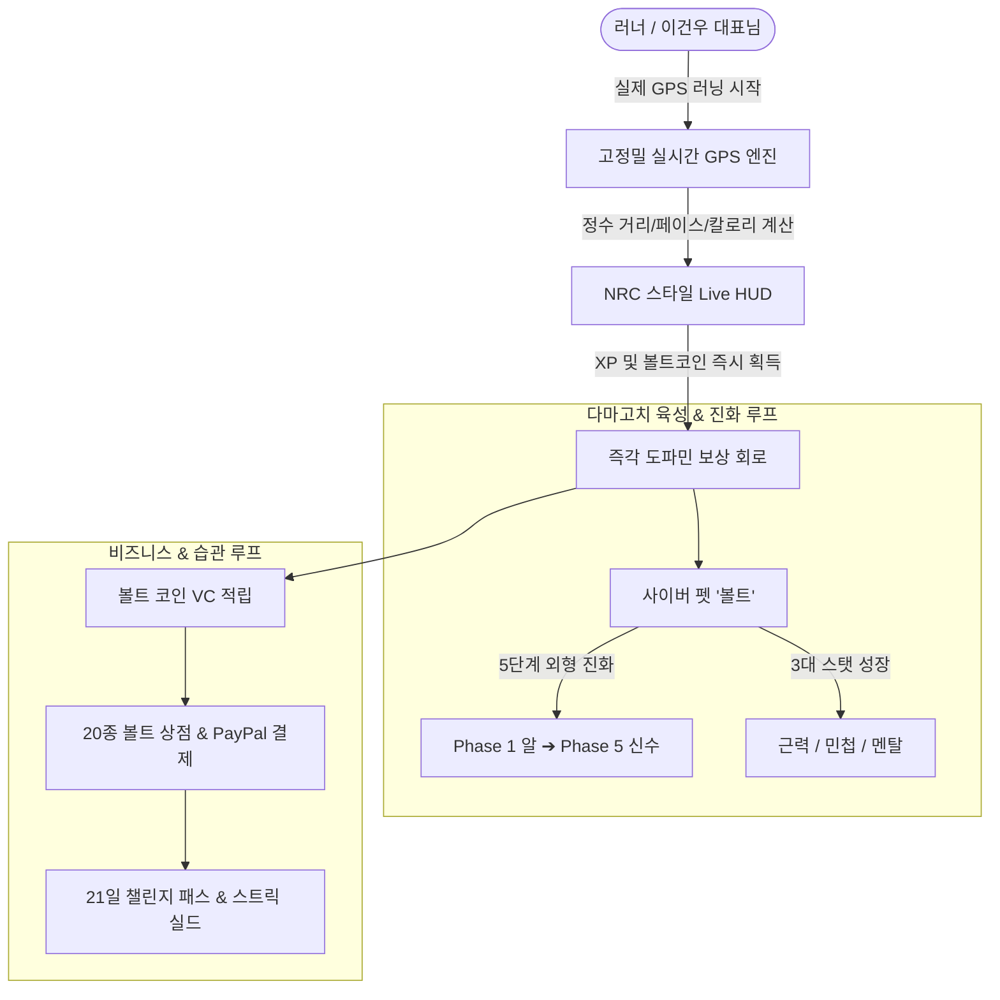
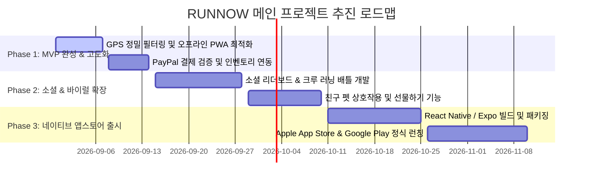

# ⚡ RUNNOW (Nike x Tamagotchi Runner) 종합 마스터 기획서 (Master PRD)

> **문서 코드**: `BSC-PRD-20260831-RUNNOW`  
> **버전**: v1.0 (메인 프로젝트 공식 승격 정본)  
> **작성 일자**: 2026년 08월 31일  
> **총괄 기획**: 이건우 대표님 & 수석비서 소하 (Soha)  
> **협업 에이전트**: PM 지윤, CTO 거누, UI/UX 재호, CFO 도현, QA 수호  
> **프로젝트 상태**: 🚀 **BSC 핵심 메인 프로젝트(Core Active)**  
> **라이브 데모**: [https://runnow-37af9.web.app](https://runnow-37af9.web.app)  

---

## 1. 📌 프로젝트 개요 및 비전 (Executive Summary & Vision)

### 1.1 프로젝트 정의
**RUNNOW**는 글로벌 러닝 트래커의 표준인 **Nike Run Club(NRC)의 세련된 고대비 다크/볼트 UI**와 **다마고치(Tamagotchi)의 레트로 사이버 펫 육성/진화 시스템**을 완벽하게 결합한 **차세대 하이퍼-게이미피케이션 러닝 OS**입니다.

### 1.2 슬로건 및 핵심 가치
> **“달리는 만큼 진화하는 나만의 사이버 펫 러닝 OS — Run, Grow, Evolve!”**
* **지루한 고독의 러닝을 캐릭터와의 동반 성장 모험으로 전환**
* **달린 거리(km)와 실시간 페이스가 즉각적인 펫의 생명력과 진화 에너지로 치환**
* **21일 습관 형성 부트캠프를 통해 러닝 비기너를 마스터 러너로 견인**



---

## 2. 🧠 행동 심리학 및 게이미피케이션 아키텍처 (Behavioral Framework)

### 2.1 도파민 보상 회로 (The Basal Ganglia Habit Loop)
* **문제점**: 체중 감량이나 심폐 지구력 강화 같은 러닝의 혜택은 수개월 뒤에 나타나는 '지연된 보상'이므로 뇌의 기저핵을 자극하지 못해 90%의 러너가 초기에 포기합니다.
* **RUNNOW의 해결책**: 러닝 종료 즉시 **수 초 내에 다마고치 레벨업 연출, 스탯 폭발적 상승, 볼트코인(VC) 지급, 픽셀 진화 애니메이션**을 제공하여 뇌가 '러닝 = 즉각적 쾌락과 보상'으로 각인하도록 설계합니다.

### 2.2 옥탈리시스(Octalysis 8 Core Drives) 적용 매트릭스

| 옥탈리시스 동기 요소 | RUNNOW 구현 메커니즘 | 실전 효과 |
| :--- | :--- | :--- |
| **CD 1: 거대한 사명감 (Epic Meaning)** | 나의 땀과 달리기가 멸종 위기의 사이버 펫을 부화시키고 진화시킨다는 내러티브 | 러닝에 감정적 몰입 부여 |
| **CD 2: 진보와 성취 (Accomplishment)** | 누적 5km, 20km, 50km, 100km 돌파 시 5단계 외형 변신 및 마일스톤 배지 수여 | 성장 가시화 및 성취감 |
| **CD 3: 창의성 부여 (Empowerment)** | 20종 장비(러닝화, 바이저, 오라 등) 커스텀 조합으로 나만의 펫 스타일링 | 개성 표출 및 자기 효능감 |
| **CD 4: 소유권과 자산 (Ownership)** | 달려서 채굴한 볼트코인(VC)으로 상점 아이템 구매 및 희귀 스킨 영구 소장 | 자산 축적 동기 강화 |
| **CD 5: 사회적 영향 (Social Influence)** | 크루 랭킹전, 친구 펫과의 페이스 대결 (Phase 2 예정) | 선의의 경쟁 및 유대감 |
| **CD 6: 희소성과 갈망 (Scarcity)** | 21일 챌린지 완주자만 착용 가능한 한정판 '골든 챔피언 오라' | 한정판 보상 소장 욕구 |
| **CD 7: 예측 불가능성 (Unpredictability)** | 러닝 중 특정 마일스톤 돌파 시 히든 럭키 박스 및 돌발 퀘스트 등장 | 매 러닝마다 새로운 재미 |
| **CD 8: 손실 회피 (Loss & Avoidance)** | 운동을 쉬면 펫이 바로 소멸하지 않고 '에너지 저하/질병' 상태로 유예 후 스트릭 실드로 방어 | 포기 방지 및 복귀 유도 |

---

## 3. 📱 5대 핵심 화면 및 UI/UX 사양서 (Stitch Design Spec)

### 3.1 디자인 토큰 (Design Tokens)
* **Primary (Volt Neon)**: `#CCFF00` (나이키 시그니처 형광 볼트 - 행동 유도, 거리 게이지, 타이머)
* **Secondary (Cyber Cyan)**: `#00F0FF` (GPS 궤적, 서브 메트릭, 홀로그램 효과)
* **Accent (Inferno Orange)**: `#FF5722` (페이스 고강도 인터벌, 긴급 경고)
* **Background Deep**: `#08090C` (최상위 배경 - OLED 배터리 소모 40% 절감)
* **Surface Carbon**: `#12161F` (카드 및 모달 배경)
* **Surface Elevated**: `#1A202C` (인터랙티브 버튼 및 입력 필드)

### 3.2 5대 탭 UI 계층 구조

```
RUNNOW Main Interface
├── 📱 Top Global Header (레벨, VC 잔액, 다마고치 상태 미니뱃지)
├── 🏃 Tab 1: LIVE RUN (실시간 GPS 게이지, 대형 거리/페이스 HUD, 펫 실시간 달리기 모션)
├── 🐣 Tab 2: TAMAGOTCHI (5단계 진화 룸, 먹이주기/놀아주기/훈련, 3대 스탯 바)
├── 🏆 Tab 3: 21-DAY CHALLENGE (3주 매트릭스, 일일 미션 체크리스트, 스트릭 보너스)
├── 🛍️ Tab 4: VOLT SHOP (20종 인게임 아이템 카탈로그, PayPal 원클릭 결제 모달)
└── 👤 Tab 5: PROFILE & GOALS (신체 지수, 누적 러닝 아카이브, 업적 배지)
```

---

## 4. 🐣 다마고치 5단계 진화 & 스탯 알고리즘

| 단계 | 캐릭터명 | 진화 조건 (누적 거리) | 비주얼 컨셉 | 인게임 패시브 버프 |
| :---: | :---: | :---: | :---: | :---: |
| **Phase 1** | **Runner Egg (러너 에그)** | 가입 즉시 (0 km) | 생동감 있게 진동하는 네온 볼트 알 | 튜토리얼 완주 시 즉시 부화 |
| **Phase 2** | **Rookie Chick (루키 병아리)** | 누적 **5.0 km** 달성 | 볼트 헤드밴드를 착용한 날쌘 병아리 | 일일 러닝 XP +10% 추가 획득 |
| **Phase 3** | **Urban Runner (어반 러너)** | 누적 **20.0 km** 달성 | 나이키 스타일 바람막이를 입은 사이버 여우 | 러닝 중 배고픔 소모 -15% 완화 |
| **Phase 4** | **Marathon Master (마라톤 마스터)** | 누적 **50.0 km** 달성 | 사이버 글래스와 카본화를 장착한 흑표범 | 칼로리당 볼트코인 획득량 +20% |
| **Phase 5** | **Cyber Speedster (사이버 신수)** | 누적 **100.0 km** 달성 | 번개 이펙트와 네온 오라를 두른 궁극의 신수 | 볼트 상점 전 품목 15% 상시 할인 |

### 3대 핵심 능력치 시스템
1. **근력 (Might)**: 총 누적 거리 및 오르막 러닝 비례 상승 ➔ 펫 체력 게이지 확장
2. **민첩 (Agility)**: 평균 페이스(min/km) 속도 비례 상승 ➔ 이동 모션 속도 가속
3. **멘탈 (Spirit)**: 21일 연속 출석 및 일일 미션 달성 비례 상승 ➔ 스트릭 보호력 강화

---

## 5. ⚡ 고정밀 GPS 엔지니어링 (High-Precision Engine)

1. **하버사인(Haversine) 미세 경로 누적 알고리즘**:
   - 직선 변위가 아닌 매 초 단위의 정밀 위경도 변화량을 누적 합산하여, **출발점으로 되돌아오는 루프 코스에서도 달린 거리를 100% 보존**합니다.
2. **소수점 없는 정수 미터(m) 실시간 표기**:
   - `0.01km` 같은 둔감한 표기 대신 `12m`, `154m`, `1,250m` 형태로 1m 단위로 숫자가 올라가 러너에게 강력한 전진 모멘텀을 제공합니다.
3. **지터(Jitter) & 안티치트(Anti-Cheat) 필터**:
   - GPS 신호 튐(Drift) 현상 방지: 3초 내 위치 변화 오차 반경 15m 이내 정지 상태 필터링
   - 차량 탑승 치팅 방지: 시속 30km/h 초과 이동 구간은 러닝 거리에서 자동 제외

---

## 6. 💎 비즈니스 모델(BM) & 20종 상점 상품 카탈로그

### 6.1 인게임 재화 체계
* **볼트 코인 (VoltCoin, VC)**: 1km 완주 시 기본 10 VC 지급 (페이스 보너스 최대 +5 VC)

### 6.2 20종 정규 상점 카탈로그 (5개 카테고리)

```json
[
  { "id": "item_01", "category": "shoes", "name": "Volt Pegasus Turbo", "priceUSD": 4.99, "voltCoins": 490, "bonus": "Speed +10%, Volt Trail Effect" },
  { "id": "item_02", "category": "shoes", "name": "Cyber VaporFly Next%", "priceUSD": 9.99, "voltCoins": 990, "bonus": "Challenge Reward 1.5x Boost" },
  { "id": "item_03", "category": "shoes", "name": "Carbon Streak X", "priceUSD": 14.99, "voltCoins": 1490, "bonus": "Pace Assist +20%" },
  { "id": "item_04", "category": "shoes", "name": "Alpha Aero Fly", "priceUSD": 19.99, "voltCoins": 1990, "bonus": "1x Instant Mission Free-Pass" },
  { "id": "item_05", "category": "energy", "name": "Volt Hydration 500ml", "priceUSD": 0.99, "voltCoins": 99, "bonus": "Hydration +100% Instantly" },
  { "id": "item_06", "category": "energy", "name": "Nano Electrolyte Gel", "priceUSD": 1.99, "voltCoins": 190, "bonus": "Energy Drain -50% for 24h" },
  { "id": "item_07", "category": "energy", "name": "Beast Protein Shake", "priceUSD": 2.99, "voltCoins": 290, "bonus": "Growth XP +150 Instantly" },
  { "id": "item_08", "category": "energy", "name": "Phoenix Elixir", "priceUSD": 4.99, "voltCoins": 490, "bonus": "Streak Recovery Shield" },
  { "id": "item_09", "category": "skin", "name": "Cyberpunk Neon Visor", "priceUSD": 2.99, "voltCoins": 290, "bonus": "Cyberpunk Visor Visual" },
  { "id": "item_10", "category": "skin", "name": "Night Tracksuit Volt", "priceUSD": 5.99, "voltCoins": 590, "bonus": "Glow-in-the-Dark Aura" },
  { "id": "item_11", "category": "skin", "name": "Golden Champion Aura", "priceUSD": 8.99, "voltCoins": 890, "bonus": "Golden Particle Effect" },
  { "id": "item_12", "category": "skin", "name": "Midnight Ninja Hoodie", "priceUSD": 6.99, "voltCoins": 690, "bonus": "Stealth Ninja Costume" },
  { "id": "item_13", "category": "wearable", "name": "Titanium GPS Pro Watch", "priceUSD": 3.99, "voltCoins": 390, "bonus": "GPS Drift Filter 99%" },
  { "id": "item_14", "category": "wearable", "name": "Aero Speed Sunglasses", "priceUSD": 2.49, "voltCoins": 250, "bonus": "Day Run Happiness x2" },
  { "id": "item_15", "category": "wearable", "name": "Reflex LED Armband", "priceUSD": 1.99, "voltCoins": 190, "bonus": "Night Run Reward +30%" },
  { "id": "item_16", "category": "wearable", "name": "SoundPulse Headband", "priceUSD": 3.49, "voltCoins": 350, "bonus": "Pace Beats Audio Pack" },
  { "id": "item_17", "category": "pass", "name": "3-Week Double XP Season Pass", "priceUSD": 9.99, "voltCoins": 990, "bonus": "21 Days Double XP" },
  { "id": "item_18", "category": "pass", "name": "Daily Streak Shield (3x)", "priceUSD": 4.99, "voltCoins": 490, "bonus": "3x Missed-Day Protection" },
  { "id": "item_19", "category": "pass", "name": "Master Runner Trophy Box", "priceUSD": 12.99, "voltCoins": 1290, "bonus": "3 Rare Gears + 1000 Coins" },
  { "id": "item_20", "category": "pass", "name": "VIP Diamond Club (Monthly)", "priceUSD": 19.99, "voltCoins": 1990, "bonus": "All-Shop 20% Discount + VIP Tag" }
]
```

---

## 7. 🚀 실행 로드맵 및 향후 작업 계획 (Next Action Items)



---
*본 마스터 기획서는 이건우 대표님의 메인 프로젝트 승격 지시에 따라 BSC 공식 기획 정본으로 영구 등록되었습니다.*
