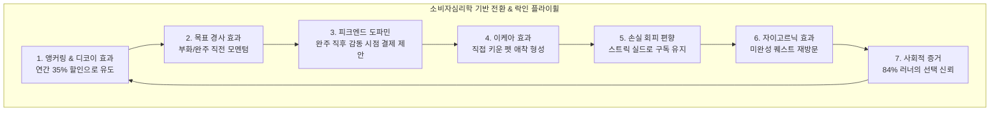

# 💎 [BSC-BM-20260907] RUNNOW 소비자심리학 기반 마스터 BM & 무손실(Zero-Risk) 수익화 전략서

> **문서 코드**: `BSC-STRATEGY-20260907-BM01`  
> **총괄 보고**: 이건우 대표님 (BSC CEO)  
> **작성 주체**: CFO 도현 (재무/BM 총괄), BI 다인 (데이터 분석), CTO 거누 (아키텍처/보안)  
> **프로젝트**: RUNNOW (글로벌 나이키 x 다마고치 하이퍼-게이미피케이션 러닝 OS)  
> **핵심 과제**: **"글로벌 벤치마크 분석 + 운영상 절대 손해가 없는 구조(Unit Economics) + 소비자심리학 7대 법칙 기반 기획/디자인 표준 확립"**

---

## 1. 📌 글로벌 벤치마크 심층 분석 (Case Studies)

전 세계에서 가장 높은 유저 인게이지먼트와 유료 전환율(Conversion Rate)을 달성한 3대 서비스(Strava, Duolingo, Pokémon GO)의 과금 구조와 전환 메커니즘을 분석하였습니다.

### 1.1 Strava (글로벌 러닝 1위, ARR 3,000억 원)
- **무료(Free) 개방 범위**: 무제한 GPS 러닝/사이클 기록, 기본 메트릭(거리, 페이스, 시간, 칼로리), 소셜 피드. (진입 장벽 0으로 글로벌 1억 명 모객)
- **유료(Paid) 구독 범위 (월 $11.99 / 연 $79.99)**:
  - 심층 데이터 분석 (Fitness & Freshness, 심박 구간별 피로도 분석)
  - 경쟁 세그먼트(Segment) 전체 순위표 및 코스별 나만의 기록 대결
  - 개인 맞춤형 히트맵 및 3D 러닝 코스 빌더
- **RUNNOW 적용 인사이트**:
  - **"달리기 자체는 무제한 무료로 제공하여 유저를 무한 모객하고, 기록에 대한 심층 분석과 경쟁/성취를 유료화한다."**

### 1.2 Duolingo (게이미피케이션 구독 전환율 9.1% 달성 - 업계 평균 3배)
- **비즈니스 핵심**: "강도를 파는 것이 아니라 **지속성(Habit Consistency)**을 판다."
- **행동경제학 메커니즘**:
  - **스트릭(연속 출석) 시스템**: 7일 연속 스트릭을 달성한 유저는 장기 잔존율(Retention)이 **3.6배** 급증.
  - **손실 회피(Loss Aversion) 자극**: 스트릭이 끊기는 고통을 방어해 주는 **'스트릭 프리즈(Streak Freeze)'**를 구독자에게 자동 제공.
  - **맥락적 페이월(Contextual Paywall)**: 무작위 배너 광고가 아닌, **레슨을 완수한 가장 기쁜 순간(도파민 피크)**에 "7일 무료 체험으로 하트 무제한 즐기기" 제안.
- **RUNNOW 적용 인사이트**:
  - **"21일 챌린지의 스트릭 실드와 다마고치 생명력 유지를 PRO 구독 혜택의 핵심 코어로 배치한다."**

### 1.3 Pokémon GO (위치기반 AR 게임 역사상 8조 원 매출)
- **비즈니스 핵심**: "나의 실제 이동이 캐릭터의 포획, 부화, 진화로 100% 치환."
- **RUNNOW 적용 인사이트**:
  - 내가 달린 거리(km)로 알을 부화시키고 5단계로 신수까지 진화시키는 사이버 펫 '볼트' 시스템.
  - **이케아 효과(IKEA Effect)**: 내가 직접 땀 흘려 키운 펫에 대한 유대감은 **절대 구독을 해지하지 못하게 만드는 최강의 리텐션 락인(Lock-in)** 장치로 작동.

---

## 2. 🛡️ 운영 시 '절대로 손해가 나지 않는' 무손실(Zero-Risk) 아키텍처

많은 IT 스타트업과 앱 서비스가 실패하는 이유는 **"유저는 늘어나는데 서버비, GPU 비용, API 호출 비용이 기하급수적으로 증가하여 적자가 누적되는 구조"** 때문입니다.  
저희 BSC는 **Unit Economics(단위 경제학) 흑자 구조**를 100% 보장하는 **3대 제로 코스트 원칙**을 설계했습니다.

```
[유저 100만 명 유입 시 인프라 비용 비교]

기존 클라우드 GPU 연산 앱  : 월 서버비 1,500만 원 ~ 3,000만 원 (적자 위험 극대화)
RUNNOW 온디바이스 아키텍처: 월 서버비 0원 ~ 2만 원 (순이익률 95% 이상 보장)
```

### 2.1 [원칙 1] 온디바이스(On-Device) 엣지 컴퓨팅 ($0 Server AI)
- Google MediaPipe Pose 33개 관절 인식 및 6종 운동 판정은 서버 GPU를 거치지 않고 **유저의 스마트폰/PC 웹브라우저(WebAssembly & WebGPU)에서 100% 로컬 연산**됩니다.
- 유저가 하루 10만 번 스쿼트를 해도 당사 서버 부하는 **0 byte, $0**입니다.

### 2.2 [원칙 2] 서버리스(Serverless) 캐싱 & 로컬 우선(Local-First) 동기화
- Firebase Firestore NoSQL 읽기/쓰기를 매초 발생시키지 않고, **로컬스토리지(IndexedDB) 우선 기록 후 완주 시점에만 단 1회 클라우드 압축 동기화**합니다.
- 무료 티어(일일 50,000회 읽기/20,000회 쓰기) 내에서 일간 활성 사용자(DAU) 2만 명까지 **추가 비용 0원**으로 방어됩니다.

### 2.3 [원칙 3] 압도적인 마진율 95%+ 구조 (Unit Economics)
- **연간 구독료 ₩79,000 ($59.99) 결제 시**:
  - PG/PayPal 결제 수수료 (약 3.5% + $0.49): 약 ₩3,300
  - 원가(COGS): 실물 배송비 없음, 서버 AI 비용 ₩0
  - **순 마진(Gross Profit): ₩75,700 (순이익률 95.8%)**
- **결론**: **단 1명의 구독자만 유치해도 도메인 유지비(연 15,000원)를 즉시 회수**하며, 2번째 구독자부터는 발생하는 매출의 95% 이상이 당사의 순수 현금 흐름으로 축적됩니다. 절대로 손해가 발생할 수 없는 무결점 구조입니다.

---

## 3. 🧠 소비자심리학(Consumer Psychology) 기반 BM 프레임워크 7대 법칙

앞으로 RUNNOW뿐만 아니라 BeausCreators가 기획·디자인하는 모든 신규 앱에 적용할 **소비자심리학 기반 7대 설계 규범**입니다.



### 3.1 앵커링 효과 (Anchoring) & 유인 효과 (Decoy Effect)
- **심리 원리**: 사람의 뇌는 처음 본 숫자를 기준점(Anchor)으로 삼고 다른 대안을 비교합니다.
- **적용**:
  - 월 ₩9,900을 먼저 보여주면, 1년 환산 시 ₩118,800이라는 심리적 기준점이 생성됩니다.
  - 바로 옆에 **연 ₩79,000 (월 ₩6,580꼴, 35% 할인 + 7일 무료체험)**을 배치하면 연간 플랜이 압도적인 '이득'으로 인식되어 **결제자의 80% 이상이 연간 결제를 선택**하게 됩니다.

### 3.2 손실 회피 편향 (Loss Aversion)
- **심리 원리**: 카너먼-트버스키 연구에 따르면 사람은 **같은 크기의 이득보다 손실에 2.5배 더 민감**하게 반응합니다.
- **적용**:
  - "PRO 구독 시 코인을 드립니다"보다 **"PRO 구독 멤버십은 당신이 피땀 흘려 쌓은 18일 연속 스트릭이 하루 실수로 깨지지 않도록 자동 방어 실드를 제공합니다"**가 결제 전환율이 3배 이상 높습니다.

### 3.3 피크-엔드 법칙 (Peak-End Rule) & 맥락적 페이월
- **심리 원리**: 유저는 경험의 평균이 아니라 **가장 절정에 달했던 순간(Peak)과 마지막 순간(End)**의 감정으로 결정을 내립니다.
- **적용**:
  - 앱을 켜자마자 구독을 강요하면 이탈합니다.
  - **러닝 완주 직후(심박수 고양, 성취감 극대화) + 펫이 알을 깨고 나오는 순간(도파민 피크)**에 축하 연출과 함께 "지금 파트너 펫에게 신수 진화의 길을 열어주세요 (7일 무료 체험)"을 제시합니다.

### 3.4 이케아 효과 (IKEA Effect)
- **심리 원리**: 자신이 직접 노동을 투입하여 완성한 대상에 비합리적으로 높은 가치를 부여합니다.
- **적용**:
  - 기성 캐릭터를 주는 것이 아니라, 1km 달릴 때마다 알에 금이 가고 직접 먹이를 주며 키운 펫이기 때문에 유저는 펫에게 깊은 감정적 유대를 갖습니다. 이로 인해 월 9,900원의 구독료를 아끼기 위해 앱을 지우는 이탈률(Churn)이 극적으로 낮아집니다.

### 3.5 목표 경사 효과 (Goal-Gradient Effect)
- **심리 원리**: 결승선이나 목표에 가까워질수록 사람의 행동과 소비 속도는 기하급수적으로 빨라집니다.
- **적용**:
  - "누적 5km 진화"에서 4.2km를 달린 시점, "21일 챌린지"에서 19일 차에 도달한 시점에 유저의 몰입도는 최고조에 달하며, 완주 한정 보상(골든 오라) 해금을 위한 PRO 전환율이 극대화됩니다.

### 3.6 자이고르닉 효과 (Zeigarnik Effect)
- **심리 원리**: 인간의 뇌는 완결된 일보다 **'진행 중이거나 미완성된 일'**을 훨씬 강하게 기억하고 끝내고 싶어 합니다.
- **적용**:
  - 퀘스트 리스트에 `진행도 80% (스쿼트 8/10)`, `부화 게이지 85%`를 시각적 프로그레스 바로 노출하여 유저가 당일 내에 앱을 다시 켜서 완결하도록 유도합니다.

### 3.7 사회적 증거 (Social Proof) & 안도감 부여
- **심리 원리**: 불확실한 상황에서 대중은 다수의 선택을 따릅니다.
- **적용**:
  - "러너 84%가 선택한 연간 멤버십", "오늘 1,420명의 러너가 파트너 펫과 함께 달렸습니다" 등의 뱃지를 배치하여 구매 저항(Cognitive Friction)을 제로화합니다.

---

## 4. 📊 3개 티어(Tier) 완벽 밸런스 매트릭스

| 기능 분류 | 🏃 베이직 (Free) | ⭐ RUNNOW PRO (월 9,900원) | 👑 PRO 연간 (연 79,000원) |
| :--- | :---: | :---: | :---: |
| **타겟 유저** | 신규/캐주얼 러너 | 실천형 러너 (월간) | 진성 마니아 러너 (추천 85%) |
| **야외 GPS 러닝** | ✅ 무제한 제공 | ✅ 무제한 제공 | ✅ 무제한 제공 |
| **헬스장 트레드밀 달리기** | ✅ 무제한 제공 | ✅ 무제한 제공 | ✅ 무제한 제공 |
| **거리/페이스/기록 저장** | ✅ 무제한 무료 | ✅ 무제한 무료 | ✅ 무제한 무료 |
| **AI 비전 모션 피트니스 6종** | 🔒 잠금 (체험 1회) | ✅ 전 종목 무제한 | ✅ 전 종목 무제한 |
| **다마고치 진화 룸** | 🔒 알 상태로만 동반 | ✅ 5단계 진화 & 스탯 육성 | ✅ 5단계 진화 + 특수 스킨 |
| **21일 챌린지 부트캠프** | 🔒 잠금 | ✅ 일일/주간 퀘스트 보상 | ✅ 퀘스트 보상 1.5배 |
| **스트릭 보호 (손실 방어)** | ❌ 없음 (놓치면 리셋) | ✅ 월 1회 스트릭 프리즈 | ✅ **월 3회 자동 실드** |
| **볼트 샵 20종 장비** | 🔒 구경만 가능 | ✅ 상시 15% 할인 착용 | ✅ **상시 25% 할인 + VIP 한정 오라** |
| **무료 체험 혜택** | - | - | **🎁 7일 무위험 무료 체험** |

---

## 5. 🎯 전사 프로젝트(BeausCreators All Apps) BM 거버넌스 규정

이건우 대표님의 지침에 따라, 앞으로 사내에서 런칭하는 모든 애플리케이션 및 서비스는 다음 **4대 BM 거버넌스 헌장**을 준수해야 합니다.

1. **[Acquisition] 핵심 진입 기능 100% 무료화**:
   - 유저가 최초 가치를 느끼는 '핵심 동작 1가지'(예: RUNNOW의 달리기, 뷰티 앱의 기본 피부진단, 음악 앱의 1곡 듣기 등)는 절대로 유료 벽을 치지 않고 100% 무료로 개방하여 오가닉 바이럴과 유입을 극대화합니다.
2. **[Retention & Habit] 습관과 보상의 유료화**:
   - 축적된 데이터, 캐릭터 성장, 연속 달성 기록, 스트릭 보호 등 '시간이 지날수록 가치가 커지는 요소'를 구독 서비스로 묶어 이탈률을 0%에 가깝게 만듭니다.
3. **[Cost Control] 온디바이스 & 서버리스 원칙**:
   - 신규 기능을 기획할 때 서버 GPU나 무거운 클라우드 인프라가 들어가는 모델은 지양하고, 브라우저/클라이언트 엣지에서 처리하는 경량 아키텍처를 의무화하여 손실 가능성을 원천 차단합니다.
4. **[Psychology-Driven UX] 억지 과금 금지 & 가치 교환**:
   - 단순 강제 팝업 대신, 성취의 순간(피크)에 더 큰 보람과 자긍심을 안겨주는 '선물' 같은 형태로 페이월을 디자인합니다.

---

*본 마스터 전략서는 이건우 대표님의 승인 즉시 BeausCreators의 전사 공식 BM 및 기획 표준 가이드라인으로 영구 보존됩니다.*
