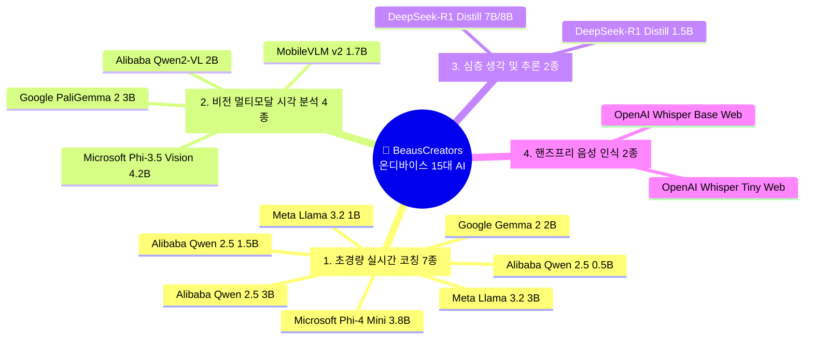

# [전사 표준 지침서] BeausCreators 온디바이스(On-Device) 15대 AI 모델 정밀 스펙 & 비즈니스 활용 가이드북

> **문서 코드**: SPEC-AI-20260902-02  
> **최초 작성일**: 2026-09-02  
> **책임자**: CTO 거누 (Backend/Infra/Architecture Lead)  
> **승인자**: 이건우 대표님 (BSC CEO)  
> **적용 대상**: 전사 모든 웹(Web/PWA) 및 모바일 앱(iOS/Android) 프로젝트

---

## 1. 총괄 개요 (Executive Summary)

본 문서는 BeausCreators의 모든 디지털 프로덕트(`beauscreators.com` 패밀리)에 탑재되는 **온디바이스(On-Device) 15대 AI 모델의 기술 스펙, 고유 강점, 그리고 프로덕트별 실전 활용 시나리오**를 집대성한 정본 가이드북입니다.

### 🌟 온디바이스 4대 절대 원칙
1. **서버 비용 완전 $0 (Zero Infra Cost)**: 1,000만 명이 동시 접속하여 AI를 구동해도 대표님 계좌에서 청구되는 중앙 서버 비용은 0원.
2. **100% 완벽한 프라이버시 (Zero Data Leak)**: 건강, 체중, 위치, 심박수, 개인 사진 데이터가 외부 서버로 전송되지 않고 기기 내부에서만 완결 처리.
3. **0.1초~0.3초 초광속 반응 (Ultra-Low Latency)**: 네트워크 왕복 시간(RTT) 없이 기기 자체 NPU/GPU를 통해 즉각 피드백.
4. **오프라인 100% 자율 구동 (Always-On)**: 통신이 끊긴 산악 트레일, 터널, 비행기 안에서도 모든 AI 기능 정상 작동.

---

## 2. 15대 온디바이스 모델별 정밀 스펙 및 비즈니스 활용처

---

### 카테고리 1: 초고속 텍스트 & 실시간 인터랙션 코칭 (7종)

#### 1. Google Gemma 2 (2B) ⭐ [기본 추천 표준 모델]
* **용량 / 메모리**: 약 1.3 GB (INT4 양자화)
* **핵심 강점**: 구글의 최첨단 아키텍처 기반으로 뛰어난 문맥 이해력 및 자연스러운 한국어 구사.
* **프로덕트 활용처**:
  * **[RunNow]**: 실시간 러닝 코칭, 페이스 조절 가이드, 피로도 문진, 일일 회고 대화.
  * **[NutriOS]**: 고객 영양 상담 문진, 섭취 음식 피드백 대화.

#### 2. Meta Llama 3.2 (1B) ⚡ [초광속 초경량 특화]
* **용량 / 메모리**: **약 700 MB (초소형)**
* **핵심 강점**: 0.1초 미만의 극한 반응 속도, 극소 배터리 소모. 구형/보급형 스마트폰에서도 무결점 구동.
* **프로덕트 활용처**:
  * **[RunNow]**: 달리는 도중 1초 만에 튀어나오는 "현재 페이스 5초 단축하세요!" 초스피드 원포인트 브리핑.
  * **[Creator Store]**: 검색어 자동완성 및 상품 추천 한 줄 요약.

#### 3. Meta Llama 3.2 (3B)
* **용량 / 메모리**: 약 1.8 GB
* **핵심 강점**: 1B의 속도감과 대형 모델의 논리성을 균형 있게 갖춘 모바일 최적화 올라운더.
* **프로덕트 활용처**:
  * **[RunNow/NutriOS]**: 주간 운동 리포트 작성, 코칭 일기 종합 브리핑.

#### 4. Alibaba Qwen 2.5 (0.5B) 🪶 [세계 초소형 마이크로 모델]
* **용량 / 메모리**: **약 300 MB**
* **핵심 강점**: 스마트워치나 저전력 웨어러블 디바이스 환경에서도 돌아가는 마이크로 엔진.
* **프로덕트 활용처**:
  * **[RunNow Watch]**: 스마트워치 단독 구동 모드(스마트폰 없이 시계만 차고 달릴 때) 지원.

#### 5. Alibaba Qwen 2.5 (1.5B)
* **용량 / 메모리**: 약 950 MB
* **핵심 강점**: 아시아권 다국어(한국어, 일본어, 중국어, 영어) 지원 탁월, 한자/전문 용어 이해력 우수.
* **프로덕트 활용처**:
  * **[글로벌 확장]**: 글로벌 러너를 위한 다국어 실시간 현지화 코칭.

#### 6. Alibaba Qwen 2.5 (3B)
* **용량 / 메모리**: 약 1.9 GB
* **핵심 강점**: 지시문 이행(Instruction Following) 능력 극대화, 정형화된 JSON 데이터 출력 탁월.
* **프로덕트 활용처**:
  * **[앱 시스템 연동]**: 사용자 대화를 분석하여 앱 내 알람, 캘린더 일정, 퀘스트 완료를 자동으로 트리거.

#### 7. Microsoft Phi-4 Mini (3.8B) 🔬 [정밀 수치 & 텔레메트리 계산 특화]
* **용량 / 메모리**: 약 2.2 GB
* **핵심 강점**: 마이크로소프트의 수학/추론 데이터셋 학습으로 복합 수치 계산 및 시계열 데이터 분석 최강.
* **프로덕트 활용처**:
  * **[RunNow]**: 1km 단위 랩타임, 심박수 변이도(HRV), VO2 Max 추정치, 케이던스 효율성 정밀 수치 분석.
  * **[NutriOS]**: 탄단지(탄수화물/단백질/지방) 그램 단위 칼로리 계산 및 결핍 영양소 정밀 산출.

---

### 카테고리 2: 비전 멀티모달 & 카메라 시각 분석 (4종)

#### 8. Google PaliGemma 2 (3B) 📸 [러닝 장비 & 부상 예방 특화]
* **용량 / 메모리**: 약 1.5 GB
* **핵심 강점**: 구글의 최신 비전-언어 결합 모델로 미세한 물리적 마모 및 패턴 식별 탁월.
* **프로덕트 활용처**:
  * **[RunNow - 러닝화 마모 스캐너]**: 러닝화 바닥 아웃솔 사진을 찍으면 내전/외전 착지 패턴 및 잔여 수명(km), 교체 시기 진단.
  * **[달리기 자세 진단]**: 러너의 착지 순간 캡처 사진을 보고 힐스트라이크/미드풋 착지 각도 교정.

#### 9. Microsoft Phi-3.5 Vision (4.2B) 🥗 [식단 & 영양 분석 특화]
* **용량 / 메모리**: 약 2.4 GB
* **핵심 강점**: 복잡한 음식 접시의 다중 메뉴 인식 및 텍스트(영수증/영양성분표 OCR) 동시 판독.
* **프로덕트 활용처**:
  * **[NutriOS - 스마트 식단 카메라]**: 밥상 사진 한 장만 찍으면 국, 밥, 반찬을 분리 인식하여 총칼로리와 나트륨 함량 즉시 산출.
  * **[가공식품 영양성분표 스캔]**: 성분표 사진을 찍어 혈당 스파이크 위험 경고.

#### 10. Alibaba Qwen2-VL (2B) 🏋️ [운동 기구 & 공간 인식]
* **용량 / 메모리**: 약 1.4 GB
* **핵심 강점**: 공간적 객체 위치 감지(Bounding Box) 및 동작 시퀀스 이해력.
* **프로덕트 활용처**:
  * **[피트니스 기구 사용법]**: 헬스장 기구를 비추면 해당 기구의 정확한 운동법과 세팅 가이드 오버레이.

#### 11. MobileVLM v2 (1.7B) 📱 [초경량 모바일 비전]
* **용량 / 메모리**: 약 1.1 GB
* **핵심 강점**: 스마트폰 AP에 최적화된 초경량 비전 모델로 연사 촬영 분석 가능.
* **프로덕트 활용처**:
  * **[러닝 중 표지판/거리 측정]**: 야외 러닝 중 코스 안내판 식별.

---

### 카테고리 3: 심층 생각 & 트레이닝 플래닝 (Reasoning 추론 2종)

#### 12. DeepSeek-R1 Distill Qwen (1.5B) 🧠 [기기 내 자율 생각 AI]
* **용량 / 메모리**: 약 1.1 GB
* **핵심 강점**: 사용자 질문에 대해 '생각하는 과정(Thinking Process)'을 거쳐 인과 관계를 검증한 후 답변 도출.
* **프로덕트 활용처**:
  * **[RunNow - 4주 맞춤 마라톤 플랜]**: "무릎 통증이 약간 있고 주 3회만 가능할 때"의 제약 조건을 스스로 추론하여 부상 위험을 배제한 훈련 주기화(Periodization) 스케줄 수립.

#### 13. DeepSeek-R1 Distill Llama (7B/8B) 🏆 [최고 사양 전문가 모드]
* **용량 / 메모리**: 약 4.5 GB (아이폰 Pro, 갤럭시 Ultra, M시리즈 Mac 등 플래그십 기기 전용)
* **핵심 강점**: 데스크톱급의 압도적인 논리력과 논문 기반 트레이닝 생리학 컨설팅.
* **프로덕트 활용처**:
  * **[전문 엘리트 코칭]**: 서브-3 마라토너 및 철인 3종 경기 선수를 위한 에너지 젤 섭취 타이밍, 젖산 역치 트레이닝 설계.

---

### 카테고리 4: 핸즈프리 음성 실시간 인식 (Speech-to-Text 2종)

#### 14. OpenAI Whisper Tiny Web (WebGPU) 🎙️ [초경량 보이스 코칭]
* **용량 / 메모리**: **약 75 MB (초극소)**
* **핵심 강점**: 화면을 보지 않고 달리는 중에도 0.05초 만에 음성을 텍스트로 변환.
* **프로덕트 활용처**:
  * **[RunNow 음성 대화]**: 달리는 도중 숨을 헐떡이며 "코치님, 지금 5km 지점인데 페이스 어때?"라고 말하면 즉각 인식하여 답변 발화(TTS 연동).

#### 15. OpenAI Whisper Base Web (WebGPU) 🎧 [노이즈 캔슬링 정밀 음성]
* **용량 / 메모리**: 약 140 MB
* **핵심 강점**: 바람 소리, 자동차 소음, 야외 환경음이 심한 도로변 러닝에서도 정확한 발음 캐치.
* **프로덕트 활용처**:
  * **[도심/야외 러닝 보이스 커맨드]**: "음악 다음 곡", "현재 심박수 알려줘", "기록 일시정지" 등의 음성 제어.

---

## 3. BeausCreators 패밀리 프로덕트별 최적 모델 매핑 매트릭스

| 프로덕트 도메인 | 1순위 기본 엔진 | 사진/시각 특화 | 심층 플래닝 특화 | 음성 특화 |
| :--- | :--- | :--- | :--- | :--- |
| **🏃 RunNow** (`runnow.beauscreators.com`) | `Gemma 2 (2B)` / `Llama 3.2 (1B)` | `PaliGemma 2 (3B)` (러닝화/자세) | `DeepSeek-R1 (1.5B)` | `Whisper Tiny Web` |
| **🥗 NutriOS** (`nutrios.beauscreators.com`) | `Gemma 2 (2B)` / `Phi-4 Mini` | `Phi-3.5 Vision` (식단/성분표) | `DeepSeek-R1 (1.5B)` | `Whisper Base Web` |
| **🛍️ Creator Store** (`store.beauscreators.com`) | `Llama 3.2 (1B)` / `Qwen 2.5 (1.5B)` | `Qwen2-VL (2B)` (상품 사진) | `Phi-4 Mini` (가격/할인율 계산) | `Whisper Tiny Web` |
| **🛠️ AI Utility Lab** (`ai.beauscreators.com`) | `Qwen 2.5 (3B)` | `PaliGemma 2 (3B)` | `DeepSeek-R1 (7B)` | `Whisper Base Web` |

---

## 4. 온디바이스 모델 라이프사이클 & 캐싱 표준 SOP

1. **온디맨드 지연 다운로드 (On-Demand Lazy Loading)**:
   * 15개 모델을 통째로 받지 않고, 사용자가 해당 기능을 켤 때만 해당 1개 모델을 다운로드 (로딩 프로그레스바 표시).
2. **영구 로컬 캐싱 (Cache API / IndexedDB)**:
   * 1회 다운로드된 모델 가중치(Weights)는 브라우저 스토리지에 암호화 보관되어 이후 재접속 시 다운로드 시간 0초.
3. **스마트 메모리 정리 (Auto Eviction)**:
   * 기기 가용 램이 부족할 경우 비활성 모델을 자동으로 언로드하여 앱의 버벅임 방지.

---
*본 가이드북은 BeausCreators 전사 AI 아키텍처의 공식 표준 정본이며, 향후 신규 프로덕트 개발 시 본 매핑 기준을 기본 준수합니다.*
