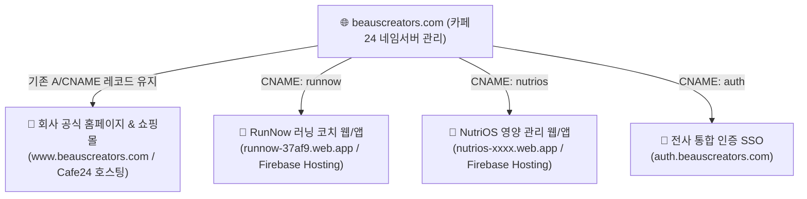
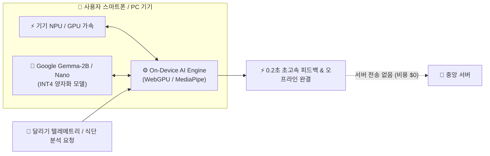

# [표준 매뉴얼] 카페24 도메인 분기 & Firebase 멀티앱 + 온디바이스(On-Device) AI 아키텍처

> **문서 코드**: SOP-INFRA-20260902-01  
> **최초 작성일**: 2026-09-02  
> **책임자**: CTO 거누 (Backend/Infra/Architecture Lead)  
> **승인자**: 이건우 대표님 (BSC CEO)  
> **상태**: 승인 완료 (전사 표준 아키텍처 지정)

---

## 1. 개요 및 비즈니스 목적

본 매뉴얼은 BeausCreators 전사 프로덕트(Web & App)를 배포·운영함에 있어 다음 3대 핵심 목표를 달성하기 위한 표준 아키텍처 및 작업 절차를 규정합니다.

1. **단일 브랜드 도메인(`beauscreators.com`) 자산화**: 기존 카페24 호스팅(쇼핑몰/회사소개)의 무중단 운영을 보장하면서, 수십~수백 개의 패밀리 앱을 서브도메인으로 확장.
2. **서버 비용 제로화 ($0 Infra Scaling)**: 사용자 수가 급증해도 중앙 LLM 서버 비용이 비례 증가하지 않는 **온디바이스(On-Device) 로컬 AI (WebGPU/MediaPipe)** 기본 탑재.
3. **Zero-Friction UX & 100% 프라이버시**: API 키 입력 없는 즉시 실행 및 민감 헬스케어/개인정보의 기기 내 완결 처리.

---

## 2. 도메인 라우팅 & 멀티앱 분기 아키텍처



### 2.1. 카페24 네임서버(DNS) 설정 표준 SOP
* **메인 도메인 원칙**: 루트 도메인(`beauscreators.com`) 및 `www`는 기존 쇼핑몰/웹호스팅에 연결 유지 (절대 삭제/수정 금지).
* **서브도메인 추가 규칙**:
  1. 카페24 관리자 콘솔 접속 ➔ `[도메인관리]` ➔ `[도메인 부가서비스]` ➔ `[DNS 관리]` 진입.
  2. 라디오 버튼 **`🔘 별칭(CNAME) 관리`** 선택.
  3. **`[CNAME 추가]`** 클릭:
     * **도메인 별칭**: 서비스 영문 약칭 (예: `runnow`, `nutrios`, `store` 등)
     * **실제 도메인명**: Firebase Hosting 기본 도메인 (예: `runnow-37af9.web.app`)
  4. Firebase 콘솔에서 도메인 연결 확인 ➔ Google SSL 보안인증서(HTTPS) 자동 발급 확인.

---

## 3. 온디바이스(On-Device) AI 표준 기술 스택

전사 모든 웹 및 앱 프로덕트는 **온디바이스 로컬 AI**를 1순위 엔진으로 채택합니다.



### 3.1. 플랫폼별 기술 표준 및 지원 모델 라인업

| 구분 | 웹 (Web / PWA) | 모바일 앱 (iOS / Android) |
| :--- | :--- | :--- |
| **코어 엔진** | **WebGPU + WebLLM / Transformers.js v3** | **Google MediaPipe GenAI / CoreML / ExecuTorch** |
| **지원 모델 라인업** | 1. **Google Gemma 2 (2B / 9B)** - 구글 표준 러닝/대화 코치<br>2. **Meta Llama 3.2 (1B / 3B)** - 700MB 초경량 0.1초 초고속 모바일 특화<br>3. **Microsoft Phi-4 Mini (3.8B)** - 텔레메트리/수치 정밀 분석 특화<br>4. **DeepSeek-R1 Distill (1.5B)** - 온디바이스 심층 추론(Reasoning) AI<br>5. **Google PaliGemma (Vision)** - 러닝화 마모도/식단 사진 온디바이스 시각 분석 | 스마트폰 AI 전용 가속기(NPU)를 활용하여 배터리 소모 극소화 및 오프라인 구동 |
| **캐싱 전략** | 브라우저 `Cache API` / `IndexedDB`에 1회 다운로드 영구 캐싱 | 앱 번들 사전 패키징 또는 앱 최초 실행 시 1회 다운로드 |
| **동작 조건** | 오프라인 100% 작동, GPU 가속 활성화 | 비행기 모드, 등산로, 터널 등 네트워크 무관 작동 |

### 3.2. 폴백(Fallback) 및 하이브리드 지원
* 구형 저사양 기기로 WebGPU를 미지원할 경우:
  * **1차 폴백**: Google AI Studio 무료 Gemma API 연결
  * **2차 옵션**: 사용자 본인 API 키 입력(BYOK: OpenAI / Gemini) 설정창 제공

---

## 4. 모바일 앱스토어 / 구글플레이 식별자 표준

모든 패밀리 앱은 `beauscreators.com` 도메인 기반의 역도메인(Reverse Domain) 식별자를 사용합니다.

```
• BeausCreators 메인 법인/브랜드 식별자: com.beauscreators
• RunNow 러닝 서비스: com.beauscreators.runnow
• NutriOS 영양 서비스: com.beauscreators.nutrios
• Creator Store 커머스: com.beauscreators.store
```

---

## 5. 보안 및 비용 통제 수칙 (Checklist)

- [x] **서버 비용 제로화**: 중앙 유료 API 키를 프론트엔드 코드에 노출하지 않고 기기 로컬 연산으로 처리.
- [x] **기존 자산 보존**: 카페24 호스팅의 웹사이트/쇼핑몰 설정에 간섭하지 않고 독립 CNAME만 증설.
- [x] **개인정보 완벽 격리**: 사용자의 위치, 심박수, 일기, 식단 데이터는 디바이스 샌드박스를 벗어나지 않음.
- [x] **SSL 자동화**: Firebase Hosting과 Google Certificate Manager를 통해 전 서브도메인 HTTPS 기본 적용.

---
*본 문서는 BSC의 공식 표준 인프라 가이드라인으로 관리되며 모든 에이전트는 신규 프로덕트 개발 시 본 매뉴얼을 필수로 준수합니다.*
